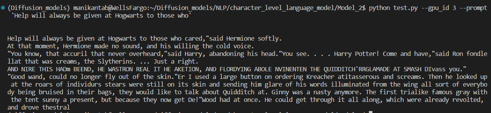

# Character_Level_Language_Modelling
- The model contains RNN architecture to predict the next character given the context.
- It was trained on the corpus of Harry Porter Books.

## Inference after training

